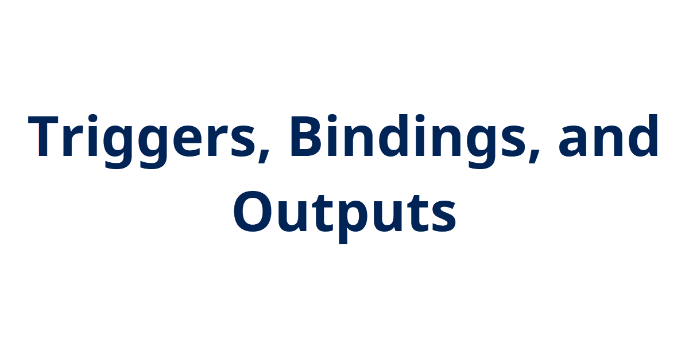

## Introduction

Continuing with Matt Allford's ([@mattallford](https://twitter.com/mattallford)) CloudSkill's course [Azure Functions for DevOps Engineers](https://portal.cloudskills.io/azure-functions-powershell), I looked into function triggers, bindings, and outputs.

## Prerequisite

- Azure Subscription
- PowerShell knowledge

## Use Case

